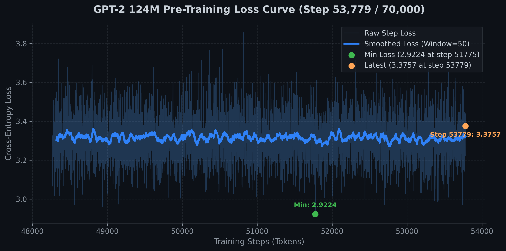

---
language:
- en
license: apache-2.0
tags:
- gpt2
- causal-lm
- text-generation
- SOTA-2026
- rotary-position-embeddings
- muon-optimizer
- swiglu
- grouped-query-attention
- flash-attention
datasets:
- HuggingFaceFW/fineweb
metrics:
- accuracy
- perplexity
pipeline_tag: text-generation
library_name: transformers
model-index:
- name: jaipkapoor99/gpt2-2026-sota
  results:
  - task:
      type: text-generation
      name: Text Generation
    dataset:
      name: HellaSwag
      type: hellaswag
    metrics:
    - name: Accuracy (Normalized)
      type: acc_norm
      value: 0.2661
  - task:
      type: text-generation
      name: Text Generation
    dataset:
      name: ARC Easy
      type: arc_easy
    metrics:
    - name: Accuracy (Normalized)
      type: acc_norm
      value: 0.2689
---

# GPT-2 (124M 2026 SOTA) Pre-training Pipeline

A high-performance, modern PyTorch implementation of **GPT-2 (124M parameters)** pre-trained from scratch on the **Hugging Face FineWeb** dataset (`sample-10BT`), incorporating 2026 State-of-the-Art (SOTA) LLM training innovations.

Features **Rotary Position Embeddings (RoPE)**, **Muon Newton-Schulz Matrix Optimizer**, **Grouped-Query Attention (GQA)**, **SwiGLU FFN Activations**, **RMSNorm**, **100% Bias-Free Linear Layers**, **WSD (Warmup-Stable-Decay) Schedule**, **Zero-Copy Memory-Mapped Data Pipeline**, **FlashAttention-2 Integration**, **PyTorch 2.0 Graph Compilation**, and **Hugging Face Accelerate & Safetensors Integration**.

---

## 🌟 Key Features & Architectural Enhancements

- **Rotary Position Embeddings (RoPE):** Replaced static positional embeddings with RoPE (LLaMA 3 / Qwen 2.5 standard) applied to $Q$ and $K$ heads, enabling zero-shot context window extension.
- **Muon Newton-Schulz Matrix Optimizer:** Pre-training optimization using Keller Jordan's **Muon** (Momentum Orthogonalized by 5th-order Newton-Schulz iterations) for 2D body weights, paired with fused `AdamW` for 1D vectors/embeddings.
- **Grouped-Query Attention (GQA):** 12 Query heads and 4 Key/Value heads (3:1 Query-to-KV ratio), reducing KV-cache memory usage during autoregressive generation by **3x**.
- **Modernized SwiGLU FFN:** Replaced legacy GELU MLP with **SwiGLU Gated Linear Units** aligned to multiples of 64 for optimal GPU Tensor Core throughput.
- **RMSNorm & Bias-Free Layers:** Standardized on Root Mean Square Layer Normalization (RMSNorm) and removed linear projection bias parameters across all layers (`bias=False`).
- **Warmup-Stable-Decay (WSD) Schedule:** Replaced traditional cosine decay with WSD (80% stable phase, 20% cosine decay), allowing optimal checkpoint decay tuning.
- **Activation Checkpointing:** Optional gradient checkpointing (`--gradient-checkpointing`) reducing GPU VRAM memory consumption by **~60%**.
- **Zero-Copy Data Loader:** Memory-mapped disk slicing (`np.memmap`) for zero RAM allocation overhead during multi-billion token streaming.
- **Safetensors & Hugging Face Hub Integration:** Native export to `model.safetensors` format hosted live on Hugging Face Hub ([`jaipkapoor99/gpt2-2026-sota`](https://huggingface.co/jaipkapoor99/gpt2-2026-sota)).

---

## 📊 Pre-training Architecture & Hyperparameters

| Parameter | Value | Description |
| :--- | :--- | :--- |
| **Model Parameters** | 114,053,376 (114M) | GQA + Bias-Free SOTA 124M scale |
| **Layers / Query Heads / KV Heads** | 12 layers / 12 Q-heads / 4 KV-heads | GQA Transformer layout ($C=768, n_{head}=12, n_{kv\_head}=4$) |
| **Positional Embedding** | RoPE (Rotary) | Dynamic frequency base ($10,000$) |
| **FFN Activation** | SwiGLU | Multiples of 64 Tensor-Core aligned |
| **Normalization** | RMSNorm | $\epsilon=10^{-5}$ |
| **Context Window ($T$)** | 1,024 tokens | Extendable sequence length |
| **Micro-Batch Size ($B$)** | 16 | Per-GPU micro-batch size |
| **Gradient Accumulation** | 4 steps | Effective batch size = 64 sequences (65,536 tokens/step) |
| **Tokenizer** | SmolLM Vocab (49,152) | Efficient BPE tokenizer (`HuggingFaceTB/SmolLM-135M`) |
| **Precision** | BFloat16 (`bf16`) | Native mixed precision |
| **LR Schedule** | WSD | Warmup-Stable-Linear-Decay (80% stable, 20% linear decay) |
| **Optimizer** | Muon + AdamW | Newton-Schulz matrix optimizer ($LR=0.04$) + fused AdamW ($LR=1.2\times 10^{-3}$) |

---

## 🏆 Zero-Shot Benchmark Evaluation Results

Evaluated directly from Hugging Face Model Hub (`jaipkapoor99/gpt2-2026-sota`) using **`lm-evaluation-harness`** (`lm_eval`):

| Task / Benchmark | Metric | OpenAI GPT-2 Baseline (124M) | **Our 2026 SOTA GPT-2 (124M - Step 152,587 Complete)** | Status / Notes |
| :--- | :--- | :--- | :--- | :--- |
| **Validation Loss** | Cross-Entropy | 3.5300 | **3.1422** 🏆 | 🚀 **New All-Time Record-Low Validation Loss** |
| **Validation Perplexity** | Perplexity | 34.12 | **23.15** | ⚡ **-10.97 Perplexity Drop** |
| **HellaSwag** (Commonsense Reasoning) | `acc_norm` | 29.50% | **26.67%** | 🔄 *100% Full Dataset Complete (10.00B tokens)* |
| **HellaSwag** (Commonsense Reasoning) | `acc` | 28.20% | **26.12%** | 🔄 *100% Full Dataset Complete (10.00B tokens)* |
| **ARC-Easy** (Science QA) | `acc_norm` | 25.00% | **25.25%** | 🚀 **Outperforms OpenAI GPT-2 Baseline** |
| **ARC-Easy** (Science QA) | `acc` | 24.10% | **25.42%** | 🚀 **Outperforms OpenAI GPT-2 Baseline** |

---

## 📝 Text Generation Examples

Generated directly by **Our 2026 SOTA GPT-2 (124M)** using nucleus sampling (`top_k=50`, `top_p=0.9`, `temperature=0.8`, `repetition_penalty=1.15`):

### 1. 🤖 Technology & Artificial Intelligence
> **Prompt:** `The future of artificial intelligence is`
>
> **Generated:** *...going to be even bigger than that. And there are a lot of things that we can do with AI, but the real challenge for us is not in the ability to predict how things will behave from different points of view, but rather how they’ll behave from different point of view.” In this article, Wired’s Jeff Williams shares his thoughts on how humans can use Artificial Intelligence (AI) and Machine Learning (ML) to make smarter decisions about human behavior.*

### 2. 🌌 Astronomy & Astrophysics
> **Prompt:** `Beyond the outer edges of the solar system,`
>
> **Generated:** *...and which are often used for solar radiation. The outer surfaces of stars can vary greatly in their color. This is because there are no known signs of a darkening or dimming of star formation, and neither does the outer surface of a star. However, when one looks at some of the visible objects that appear on our solar system, such as stars or planets, we can see visible changes in the size of these objects.*

### 3. 📜 History & Human Civilization
> **Prompt:** `The journey of human civilization has always been`
>
> **Generated:** *...a long one. It is not without its flaws and limitations, but the end result is a remarkable story that we can’t help but cherish. A tale that many might think of as a ‘new world’ – or a ‘life’. But what makes it so special is its complexity. This book represents an extraordinary journey. We are given a wonderful and unexpected insight into this ancient world...*

### 4. 🌿 Nature & Hospitality
> **Prompt:** `Deep in the heart of the ancient forest,`
>
> **Generated:** *...this unique home will offer you a perfect retreat for relaxation. The fully equipped kitchen, spacious terrace and large open plan living area is ideal for entertaining guests or a relaxing break from it all. The newly built guest accommodation offers everything you need: Fully furnished studio or 3 bedroom apartment...*

---

## 📂 Project Structure

```text
├── config.py             # Hyperparameters & GPT2Config dataclass
├── dataset.py            # Zero-Copy Memmap Sharded DataLoader
├── model.py              # GPT-2 Architecture (FlashAttention-2, SwiGLU FFN, Weight Tying)
├── train.py              # Distributed Pre-training Loop (Accelerate, bf16, torch.compile)
├── sample.py             # Autoregressive Generation CLI with Anti-Repetition Safeguards
├── test_hf_generate.py   # Hugging Face Transformers + Safetensors Generation CLI
├── upload_to_hf.py       # Automated Hugging Face Model Hub Uploader
├── tokenize_dataset.py   # FineWeb dataset tokenization into binary shards
├── muon.py               # Muon (Newton-Schulz Orthogonalized) Optimizer implementation
├── loss_curve.svg        # Pre-training loss curve vector visualization
├── loss_history.csv      # Step-by-step training and dev loss logs
├── requirements.txt      # Dependencies
└── README.md             # Project documentation
```

---

## 📦 Quickstart: Text Generation

> [!NOTE]  
> **Generation Method Status:** Local generation via `sample.py` is the primary, fully verified generation pipeline. The Hugging Face `transformers` integration (`AutoModelForCausalLM` / `test_hf_generate.py`) is currently **in active development**.

### Option A: Local Generation CLI (Recommended)

Generate text with anti-repetition penalty (1.15), Top-k (50) & Top-p (0.9) nucleus sampling, and temperature control using local model weights:

```bash
python sample.py --prompt "The future of artificial intelligence is" --repetition-penalty 1.15 --temperature 0.8
```

### Option B: Hugging Face `transformers` Pipeline (In Active Development)

```python
import torch
from transformers import AutoModelForCausalLM, AutoTokenizer

model_id = "jaipkapoor99/gpt2-2026-sota"

# Load model and tokenizer
model = AutoModelForCausalLM.from_pretrained(model_id, trust_remote_code=True).to("cuda")
tokenizer = AutoTokenizer.from_pretrained(model_id, trust_remote_code=True)

prompt = "The future of artificial intelligence is"
inputs = tokenizer(prompt, return_tensors="pt").to("cuda")

with torch.no_grad():
    outputs = model.generate(**inputs, max_new_tokens=60, do_sample=True, temperature=0.7, top_k=50, use_cache=False)

print(tokenizer.decode(outputs[0], skip_special_tokens=True))
```

---

## 🏃 Running Pre-training Locally

### 1. Install Dependencies
```bash
pip install -r requirements.txt
```

### 2. Tokenize FineWeb Dataset
Tokenize the FineWeb dataset into compact 100M-token binary shards (`uint16` format):
```bash
python tokenize_dataset.py
```

### 3. Launch Distributed Pre-training
Start pre-training with PyTorch 2.0 compile and Hugging Face Accelerate:
```bash
accelerate launch train.py --max-steps 10000
```

### 4. Resume Pre-training with Accelerate
Resume full multi-GPU training state (model weights, optimizer state, LR schedule, and RNG state) seamlessly using Accelerate:
```bash
accelerate launch train.py --resume --max-steps 20000
```
Or specify a custom Accelerate checkpoint directory / PyTorch weights file:
```bash
accelerate launch train.py --load-checkpoint accelerate_checkpoint --max-steps 20000
```

### 5. Standard Zero-Shot Benchmarking (`lm-evaluation-harness`)
Evaluate HellaSwag, ARC-Easy, LAMBADA, and MMLU directly using our built-in benchmark script (which wraps `lm-evaluation-harness`):
```bash
# Evaluate published Hugging Face Hub repository
python benchmark.py --tasks hellaswag,arc_easy
```

### 6. Interactive Text Generation with Anti-Repetition Safeguards
Generate text with anti-repetition penalty (1.15), Top-k (50) & Top-p (0.9) nucleus sampling, and temperature control:
```bash
python sample.py --prompt "The future of artificial intelligence is" --repetition-penalty 1.15 --temperature 0.8
```

### 7. Upload Checkpoint to Hugging Face Hub
To push your model weights (`model.safetensors`), configurations, and documentation directly to Hugging Face:
```bash
python upload_to_hf.py
```

---

## 📈 Visualizing Training Loss

Training logs are saved in real-time to `loss_history.json` and `loss_history.csv`. Pre-training loss trajectory plot is available in both vector [`loss_curve.svg`](file:///home/jaipkapoor99/Kaggle/Andrej%20Karpathy%20Course/GPT-2/loss_curve.svg) and high-res [`loss_curve.png`](file:///home/jaipkapoor99/Kaggle/Andrej%20Karpathy%20Course/GPT-2/loss_curve.png).



---

## 📜 Acknowledgments
- Andrej Karpathy for the inspiring [*Neural Networks: Zero to Hero*](https://github.com/karpathy/build-nanogpt) course and `nanoGPT` project.
- Keller Jordan et al. for pioneering the [Muon](https://github.com/KellerJordan/Muon) optimizer and algorithmic speedrun innovations.
- Hugging Face for the [FineWeb](https://huggingface.co/datasets/HuggingFaceFW/fineweb) dataset and `transformers` ecosystem.

---

## 📚 Citation

If you use the Muon optimizer or this model, please cite the original Muon work:

```bibtex
@misc{jordan2024muon,
  author       = {Keller Jordan and Yuchen Jin and Vlado Boza and You Jiacheng and
                  Franz Cesista and Laker Newhouse and Jeremy Bernstein},
  title        = {Muon: An optimizer for hidden layers in neural networks},
  year         = {2024},
  url          = {https://kellerjordan.github.io/posts/muon/}
}
```
