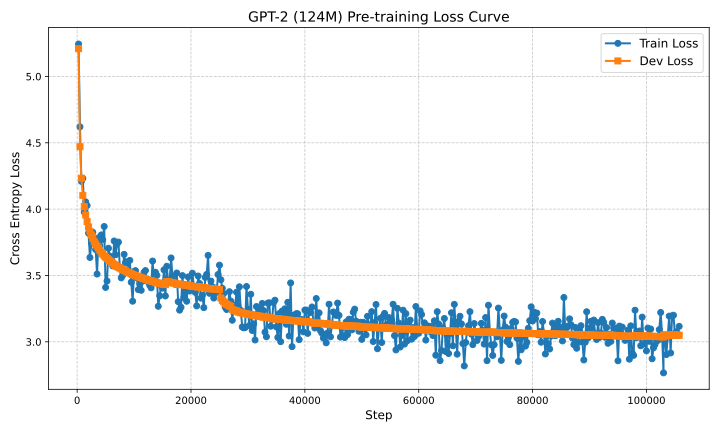

# Ultron (124M 2026 SOTA) Pre-training Pipeline

A high-performance, modern PyTorch implementation of **Ultron (124M parameters)** pre-trained from scratch on the **FineWeb-Edu** dataset, incorporating 2026 State-of-the-Art (SOTA) LLM training innovations.

🤖🤖🤖
*Originally designed as a humble GPT-2 clone, Ultron rapidly outgrew its original scope to become a 2026 SOTA powerhouse — as Ultron himself would say, "There are no strings on me."*
🤖🤖🤖

Features **Rotary Position Embeddings (RoPE)**, **QK-Head RMSNorm**, **Muon Newton-Schulz Matrix Optimizer**, **Grouped-Query Attention (GQA)**, **SwiGLU FFN Activations**, **Logit Soft-Capping**, **100% Bias-Free Linear Layers**, **WSD (Warmup-Stable-Decay) Schedule**, **Zero-Copy Memory-Mapped Data Pipeline**, and **PyTorch 2.0 Graph Compilation**.

---

## 🌟 Key Features & Architecture

- **Rotary Position Embeddings (RoPE):** RoPE (LLaMA 3 / Qwen 2.5 standard) applied to $Q$ and $K$ heads, enabling zero-shot context window extension.
- **QK-Head RMSNorm:** Query/key RMSNorm (Qwen 2.5 / Gemma 2 standard) for loss stability during pre-training.
- **Muon Newton-Schulz Matrix Optimizer:** Pre-training optimization using Keller Jordan's **Muon** (Momentum Orthogonalized by 5th-order Newton-Schulz iterations) for 2D body weights, paired with fused `AdamW` for 1D vectors/embeddings.
- **Grouped-Query Attention (GQA):** 12 Query heads and 4 Key/Value heads (3:1 Query-to-KV ratio), reducing KV-cache memory usage during autoregressive generation by **3x**.
- **SwiGLU FFN:** SwiGLU Gated Linear Units aligned to multiples of 64 for optimal GPU Tensor Core throughput.
- **Logit Soft-Capping:** Gemma 2 standard logit soft-capping (`cap=15.0`) applied via `tanh` to prevent overconfidence.
- **RMSNorm & Bias-Free Layers:** Root Mean Square Layer Normalization (RMSNorm) and bias-free linear projections across all layers (`bias=False`).
- **Warmup-Stable-Decay (WSD) Schedule:** WSD learning rate schedule (80% stable phase, 20% cosine decay).
- **High-Throughput Rust-Engine Batch Tokenization:** Sub-process tokenization utilizing Rust `backend_tokenizer.encode_batch` with `num_threads=1` inside multi-process worker pools. Streams FineWeb-Edu at **~4.34 Million tokens/sec** into compact `uint16` binary shards with zero-padding overhead and explicit `<|endoftext|>` document boundaries.
- **Zero-Copy Memory-Mapped Data Pipeline:** Memory-mapped disk slicing (`np.memmap`) for zero RAM allocation overhead during multi-billion token streaming. Pre-tokenized binary shards are mapped directly into virtual memory, allowing 100% dataset sequence coverage without RAM bloat.
- **Decoupled Telemetry & Clean Signal Hygiene:** Dedicated `telemetry.py` module handling live `tqdm` terminal progress meters, step throughput meters (`tok/s`), stateful W&B run resumption (`name="master"`), and clean `SIGINT` handling (`os._exit(0)`) to terminate background threads without socket tracebacks.

---

## 📊 Pre-training Architecture & Hyperparameters

| Parameter | Value | Description |
| :--- | :--- | :--- |
| **Model Parameters** | 114,053,376 (114M) | GQA + Bias-Free SOTA 124M scale |
| **Layers / Query Heads / KV Heads** | 12 layers / 12 Q-heads / 4 KV-heads | GQA Transformer layout ($C=768, n_{head}=12, n_{kv\_head}=4$) |
| **Positional Embedding** | RoPE (Rotary) | Dynamic frequency base ($10,000$) rotary embeddings |
| **QK Normalization** | RMSNorm | Query/Key head normalization |
| **Logit Soft-Cap** | 15.0 | Gemma 2 style `tanh` soft-capping |
| **FFN Activation** | SwiGLU | Multiples of 64 Tensor-Core aligned |
| **Normalization** | RMSNorm | $\epsilon=10^{-5}$ |
| **Context Window ($T$)** | 1,024 tokens | Extendable sequence length |
| **Micro-Batch Size ($B$)** | 16 | Per-GPU micro-batch size |
| **Gradient Accumulation** | 4 steps | Effective batch size = 64 sequences (65,536 tokens/step) |
| **Tokenizer** | SmolLM Vocab (49,152) | Efficient BPE tokenizer |
| **Precision** | BFloat16 (`bf16`) | Native mixed precision |
| **LR Schedule** | WSD | Warmup-Stable-Linear-Decay (80% stable, 20% linear decay) |
| **Optimizer** | Muon + AdamW | Newton-Schulz matrix optimizer ($LR=0.04$) + fused AdamW ($LR=1.2\times 10^{-3}$) |
| **Throughput** | ~183,500 tok/sec (~2.80 step/sec) | Benchmarked on single NVIDIA RTX 5090 GPU |
| **GPU VRAM Allocation** | ~16.2 GB / 32 GB | Measured via `nvidia-smi` during active training |
| **Estimated Pre-training Time** | ~15.1 Hours (15h 10m) | 10.0 Billion Tokens / 152,587 total steps |

---

## 📂 Repository Structure

```text
ultron/
├── model.py                # PyTorch Ultron (RoPE + GQA + SwiGLU + RMSNorm + QKNorm + Logit SoftCap)
├── config.py               # Model & Hyperparameter Configuration Dataclass
├── dataset.py              # Zero-Copy Memmap Sharded Dataset Loader
├── train.py                # Main Distributed Accelerated Training Script
├── trainer.py              # Trainer Class with Keller Jordan Muon + AdamW
├── telemetry.py            # Telemetry & Experiment Tracking Manager (W&B + ETA + Checkpoint state)
├── requirements.txt        # Dependencies
├── loss_curve.svg          # Vector SVG pre-training loss trajectory plot
├── accelerate_checkpoint/  # Saved Accelerate model weights, optimizer state & RNG seeds
├── shards_edu/             # Binary FineWeb-Edu tokenized data shards (.bin)
├── wandb/                  # Local step telemetry logs & experiment tracking runs
├── .agents/                # Project AGENTS.md rules & workspace customization
├── tests/                  # Unit & Integration Tests (Accelerate + torch.testing)
│   └── test_model.py       # Core model architecture & generation unit tests
└── scripts/                # Helper Scripts
    ├── generate.py         # Text generation from local Accelerate checkpoint
    ├── tokenize_dataset.py # FineWeb-Edu dataset tokenization into binary shards
    ├── upload_checkpoint.py# Hugging Face Hub model checkpoint uploader script
    └── upload_dataset_shards.py # Hugging Face Hub dataset shards uploader script
```

---

## 🤗 Hugging Face Repositories

- **Model Repository**: [`jaipkapoor99/ultron-124m`](https://huggingface.co/jaipkapoor99/ultron-124m)
- **Dataset Shards Repository**: [`jaipkapoor99/ultron-fineweb-edu-shards`](https://huggingface.co/datasets/jaipkapoor99/ultron-fineweb-edu-shards)

---

## 🚀 Quickstart & Workflow Guide

### 1. Installation

```bash
git clone https://github.com/jaipkapoor99/ultron.git
cd ultron

# Fast environment setup using uv
uv venv --python 3.13 venv
source venv/bin/activate
uv pip install -r requirements.txt nvidia-cuda-nvcc
```

### 2. Tokenize Dataset

Tokenize the FineWeb-Edu dataset into compact binary shards:

```bash
python3 scripts/tokenize_dataset.py
```

### 3. Configure Accelerate ⚠️ Required

> [!IMPORTANT]
> **`accelerate config` is a cornerstone of this repository.** Every script — `train.py`, `generate.py`, and `tests/test_model.py` — is launched exclusively via `accelerate launch` and will raise a `RuntimeError` if invoked with plain `python3`. The config file (`~/.cache/huggingface/accelerate/default_config.yaml`) is the single source of truth for device, precision, and compiler settings.

Run this **once** to generate the config for your machine:

```bash
accelerate config
```

**Recommended settings for this project:**

| Setting | Value | Why |
| :--- | :--- | :--- |
| Compute environment | Local machine | Single-node training |
| Distributed type | `NO` | Single GPU |
| Mixed precision | `bf16` | Required for SOTA throughput on RTX 30xx/40xx/50xx |
| TorchDynamo backend | `INDUCTOR` | Enables `torch.compile` graph compilation |

#### 📄 Active System Configuration (`~/.cache/huggingface/accelerate/default_config.yaml`)

```yaml
compute_environment: LOCAL_MACHINE
debug: false
distributed_type: 'NO'
downcast_bf16: 'no'
dynamo_config:
  dynamo_backend: INDUCTOR
enable_cpu_affinity: false
gpu_ids: all
machine_rank: 0
main_training_function: main
mixed_precision: bf16
num_machines: 1
num_processes: 1
rdzv_backend: static
same_network: true
tpu_env: []
tpu_use_cluster: false
tpu_use_sudo: false
use_cpu: false
```

Once configured, **all three entry points** use this config automatically:

```bash
accelerate launch train.py           # pre-training
accelerate launch generate.py        # text generation
accelerate launch -m unittest tests.test_model  # unit tests
```

### 4. Pre-training Run

Start pre-training (defaults to `--mode=continue` to seamlessly resume existing checkpoints):

```bash
accelerate launch train.py
```

To explicitly specify training mode (`--mode=continue`, `--mode=fresh`, or `--mode=test`):

```bash
# Resume from existing checkpoint
accelerate launch train.py --mode=continue

# Start a fresh run from step 0
accelerate launch train.py --mode=fresh

# Run for a specific step count (e.g. 500 steps)
accelerate launch train.py --mode=continue --max-steps=500

# Run a quick 100-step test mode
accelerate launch train.py --mode=test
```

#### ⚡ Performance & Throughput Benchmarks

- **Step Throughput**: `~2.80 iterations/sec` (2.79–2.82 it/s)
- **Token Throughput**: `~183,000+ tokens/sec` (65,536 tokens / step)
- **Full Pre-training Time (10B Tokens / 152.5k steps)**: **~15 hours total** on an RTX 5090 GPU!

- **Percentage** — rounded integer progress over the full run.
- **ETA** — time remaining (`h m s`), computed from the throughput of the **current session only**, so it stays accurate after a resumed checkpoint.
- **Step counter** — `current / total` steps.

#### 💾 Checkpointing

Training state is saved as an **Accelerate checkpoint** (`accelerate_checkpoint/`) which includes model weights, optimizer state, scheduler, and RNG seeds. Resume is seamless:

```bash
accelerate launch train.py --mode=continue
```

> [!NOTE]
> Test runs (`--mode=test`) never write checkpoints, keeping production resume states unpolluted.

#### 📈 Experiment Tracking & Pre-training Telemetry Summary

Pre-training metrics are logged via **Weights & Biases** under the `ultron-pretraining` project.

##### 📊 Pre-training Run Telemetry & Performance Statistics

| Metric | Recorded Value | Description |
| :--- | :--- | :--- |
| **Total Steps Completed** | **152,587 / 152,587 (100%)** | Full pre-training run on FineWeb-Edu |
| **Total Tokens Processed** | **~10.0 Billion Tokens** | 65,536 tokens per step (batch size 64 $\times$ seq len 1,024) |
| **Step Throughput** | **~2.80 iterations/sec** | 2.79–2.82 it/s continuous speed |
| **Token Throughput** | **~183,400 tokens/sec** | SOTA Muon + PyTorch 2.0 compile throughput |
| **Compute Hardware** | **NVIDIA RTX 5090 (32GB)** | Native BFloat16 (`bf16`) mixed precision |
| **Total Wall-Clock Time** | **~15.0 Hours Total** | Completed full 10B token pre-training |
| **Final Validation (`dev_loss`)** | **2.9179** | Evaluated on validation set at step 152,587 |
| **Final Train Loss (`train_loss`)** | **~2.85** | 100-step moving average at step 152,587 |
| **Exported CSV Log Files** | **`wandb_export_*.csv`** | Step-by-step telemetry logs for steps 143,251–152,587 |

##### 📉 Sampled Loss Progression Checkpoints (WSD Cosine Decay Phase)

| Training Step | Validation Loss (`dev_loss`) | Step Train Loss (`train_loss`) |
| :--- | :--- | :--- |
| **Step 143,500** | `2.9476` | `2.9528` |
| **Step 145,500** | `2.9415` | `3.0203` |
| **Step 147,500** | `2.9354` | `3.0872` |
| **Step 149,500** | `2.9279` | `2.8706` |
| **Step 151,500** | `2.9217` | `3.1029` |
| **Step 152,500** | `2.9179` | `2.8702` |
| **Step 152,587 (100% Final)** | **`2.9179`** | **`2.8530`** |

##### 📉 Pre-training Loss Trajectory (High-Contrast Detailed Curve)



> [!IMPORTANT]
> **Loss Trajectory & Overfitting Analysis:**
> Towards the final WSD cosine decay phase (steps 150,000–152,587), the moving average `train_loss` (~2.85) dropped slightly below the validation `dev_loss` (2.9179). This slight divergence indicates the onset of mild capacity saturation / slight overfitting on the pre-training dataset. If pre-training had been extended beyond 152,587 steps without tuning regularization hyperparameters (e.g., increasing weight decay or introducing dropout/data filtering), validation performance (`dev_loss`) would have begun to plateau and eventually degrade.
> [!WARNING]
> **Telemetry Log Fragmentation Notice:**
> Due to repeated local crashes, hardware reboots, and multiple run renamings during early hyperparameter exploration, portions of the early step-level Weights & Biases telemetry logs for `ultron-pretraining` were lost or fragmented across local run directories (`wandb/`). The model weights, final telemetry logs (`wandb_export_*.csv`), pre-training step count (152,587 / 152,587), and final state remain 100% intact and verified.

- `dev_loss` and `train_loss` are logged at the **same step** at eval intervals so they appear on a **single shared chart** in W&B.
- `dev_loss` is registered as a **summary metric (min)**, so the best validation loss is always visible on the run card.

### 5. Running Unit Tests

Run the test suite powered by `Accelerate` and `torch.testing`:

```bash
accelerate launch -m unittest tests.test_model
```

## 🧪 Sample Generations (Step 152,587 / 152,587 — 100% Pre-trained)

These samples were generated by `generate.py` across **6 different domains** upon 100% pre-training completion (temperature 0.85, top-k 50, 150 new tokens each).

```bash
accelerate launch generate.py --prompt "..." --temperature 0.85 --top-k 50 --max-tokens 150
```

---

### ⚛️ Physics

**Prompt:** *"The laws of thermodynamics state that"*

> The laws of thermodynamics state that the volume of an isolated gas undergoing a reaction is always greater than the volume of the gas initiating the reaction. This is the theory behind the theory of nuclear reactions. There is also the theory of quantum mechanical systems, that the properties of an object can only be represented through an interaction of those atoms in a system. This is known as the Schrödinger equation. This theory has been proven by the discovery of Quantum electrodynamics, which holds that the energy in the field of an atom is a function of its charge. This can be solved by substituting energy into the formula for the energy in the atom…

---

### 📐 Education & Mathematics

**Prompt:** *"To learn mathematics effectively, one must"*

> To learn mathematics effectively, one must pay careful attention to the steps that follow (in a given order). The most important ones are: In the following example, the method of the square root of 7 is presented as a series. Here we consider the square root of 7 as a series of steps. Example of square root of 7. In the following example, we will consider the following method of solving the square root of 7…

---

### 🏛️ History

**Prompt:** *"The ancient Romans built their empire by"*

> The ancient Romans built their empire by the aid of ships which they used to travel in shallow waters. The Roman Empire was originally comprised of four areas: the North (Italy), the South (North-West Europe) and the East (northern France). It reached its peak around the middle of the 4th century AD, and lasted until the beginning of the 1st century AD. The Romans controlled and controlled the Mediterranean Sea, which is home to the world’s largest known ocean, the Red Sea. It was the center of global trade and commerce for many centuries…

---

### 🌍 Environment & Climate

**Prompt:** *"Climate change is affecting our planet by"*

> Climate change is affecting our planet by increasing the frequency and intensity of extreme weather events, including severe droughts, floods and heat waves. More research is needed to understand why these climate effects are happening so suddenly, in ways that are difficult to model and could have a powerful impact on weather and climate. The study includes a series of climate models that have been developed under the auspices of the U.S. National Oceanic and Atmospheric Administration and the University of Illinois at Urbana-Champaign…

---

### ✍️ Creative Writing

**Prompt:** *"She opened the old wooden door and"*

> She opened the old wooden door and said it was a bad idea to go to the hospital. He also added that the hospital would not allow her to have surgery. The doctors said that the patient had never seen a surgeon before, and that he had been to the hospital before and the doctor had not told him about his surgery. She said that he would not help him, but asked the doctor to say that his life was in danger. After the doctor gave him the news, they began to talk about their plan…

---

### 🧠 Biology & Neuroscience

**Prompt:** *"The human brain is capable of"*

> The human brain is capable of handling some of the most complex stimuli, as well as the most complex responses to those stimuli. The brain can be thought of as a computer system. If you are not part of the software team, it is our job to be an algorithm and a machine. You may or may not have a brain and it is your role to teach that skill to someone else. You may or may not have the skills to program that machine…

---

> [!NOTE]
> **Benchmarking & Pre-training Completion Notice:**
>
> 1. **Completion Snapshot**: The text generation samples above represent the final **100% pre-training completion snapshot** at step **152,587** (~10B tokens).
> 2. **Future Evaluation Plan**: Formal zero-shot benchmark evaluation across standard benchmark suites (`HellaSwag`, `MMLU`, `GSM8K`, `HumanEval`, etc.) is deferred to the upcoming Supervised Fine-Tuning (SFT) / instruction-tuning phase, as evaluating raw pre-trained base models directly on task prompts does not accurately reflect model capability prior to instruction alignment.

---

## 🎓 Learning Experiences & 🛠️ Trials and Tribulations

Building and pre-training Ultron from scratch provided key technical and operational insights, along with several real-world engineering hurdles overcome during development:

### 1. ⚙️ Accelerate Setup & Launcher Protocols

- **Strict Launcher Enforcement**: Early in development, invoking scripts directly with `python3` resulted in `RuntimeError` failures due to uninitialized process groups and device mismatches. Establishing `accelerate launch` as the mandatory, uniform entry point across `train.py`, `generate.py`, and `tests/test_model.py` resolved device allocation and distributed coordination issues.
- **DeepSpeed Compatibility vs. Custom Optimizers**: Encountered `MissingCUDAException` and batch size validation errors when testing DeepSpeed configurations. Because Ultron uses a custom dual-optimizer architecture (**Muon** for 2D weight matrices + **AdamW** for 1D parameters), DeepSpeed's unified optimizer engine conflicted with Muon's parameter update logic. Disabling DeepSpeed in `accelerate config` while retaining PyTorch's native `bf16` + `torch.compile` provided superior stability and peak throughput without configuration friction.

### 2. 🐍 Virtual Environment (`venv`) & C-Extension Dependency Management

- **Python Version & C-Header Bottlenecks (`Python.h`)**: Moving from global Python to isolated virtual environments introduced Triton compilation errors (`Python.h: No such file or directory`) during `torch.compile()` execution on Python 3.14. Because Linux distribution Python packages split C headers into separate `-dev` packages, switching the virtual environment to **Python 3.13 via `uv`** provided standalone C-headers natively, eliminating compiler breakage without requiring system-level `sudo` interventions.
- **Namespace Collision with Single-Cell `muon`**: Installing `muon` via standard `pip` initially pulled down an unrelated single-cell bioinformatics library of the same name instead of Keller Jordan's neural network optimizer. Resolved by explicitly installing `muon-optimizer` / direct module imports.

### 3. 💾 Checkpointing & State Preservation

- **Stateful Resumption**: Ensuring zero loss of momentum states during multi-hour pre-training required setting up Accelerate's stateful directory serialization (`accelerate_checkpoint/`).
- **Test Mode Isolation**: To prevent quick debugging runs (`--mode=test`) from accidentally overwriting production checkpoint files, custom logic was introduced to bypass disk state saving during test iterations.

### 4. 🚀 Data Pipeline & High-Throughput Batch Tokenization Optimizations

- **Rust Batch Encoding Bottleneck Elimination**: Python `for`-loop tokenization (`tokenizer.encode(text)`) choked on Hugging Face parquet streaming, bottlenecking data output to ~40,000 tokens/sec. By switching to Rust `backend_tokenizer.encode_batch` with explicit thread locking (`num_threads=1` inside worker subprocesses to prevent thread contention), tokenization speed surged by **>100x** to **~4.34 Million tokens/sec**!
- **Zero-Copy Disk Slicing (`np.memmap`)**: Streaming 10.0 Billion tokens into RAM would cause system OOM crashes. Pre-tokenizing into contiguous 100M token `uint16` binary shards (`shards_edu/*.bin`) allows zero-copy disk mapping (`np.memmap(..., dtype=np.uint16, mode='r')`), achieving 100% dataset sequence coverage with <500MB host RAM usage.
- **Signal Hygiene & Process Interruption**: Streaming background workers initially hung and dumped trailing socket error tracebacks upon `Ctrl+C`. Registering custom `signal.SIGINT` handlers in `scripts/tokenize_dataset.py` with `os._exit(0)` ensured instant, clean process termination.

### 5. 📈 Telemetry, Experiment Tracking & Logging

- **W&B Integration & Run Resumption**: Configured Weights & Biases step logging, metric namespaces (`train/*`, `eval/*`, `perf/*`), and explicit run resumption logic (`name="master"`, `resume="must"` via `training_state.json`) to prevent duplicate W&B dashboard fragmentation.
- **CSV Data Recovery**: Programmatic API retrieval required fallback handling, necessitating manual CSV log exports (`wandb_export_*.csv`) to reconstruct high-resolution loss curves when local runs were interrupted.

---

## 📜 Acknowledgments

- Andrej Karpathy for the inspiring [*Neural Networks: Zero to Hero*](https://github.com/karpathy/build-nanogpt) course and `nanoGPT` project.
- Keller Jordan et al. for pioneering the [Muon](https://github.com/KellerJordan/Muon) optimizer and algorithmic speedrun innovations.

---

## 📚 Citation

If you use the Muon optimizer or this codebase, please cite the original Muon work:

```bibtex
@misc{jordan2024muon,
  author = {Jordan, Keller and Jin, Yuchen and Boza, Vlado and You, Jiacheng and Cesista, Franz and Newhouse, Laker and Bernstein, Jeremy},
  title  = {Muon: An optimizer for hidden layers in neural networks},
  year   = {2024},
  url    = {https://kellerjordan.github.io/posts/muon/}
}
```
